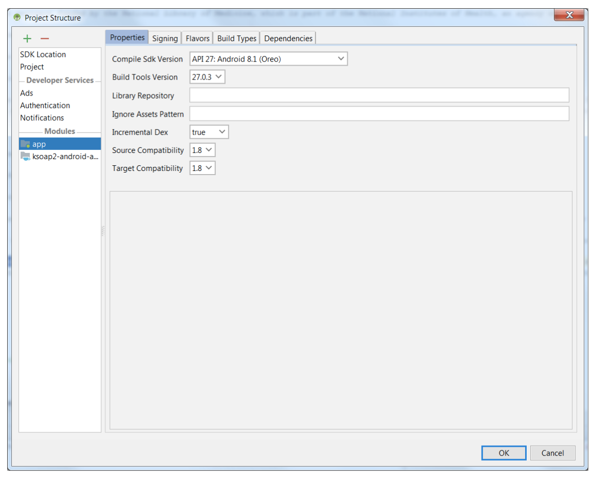
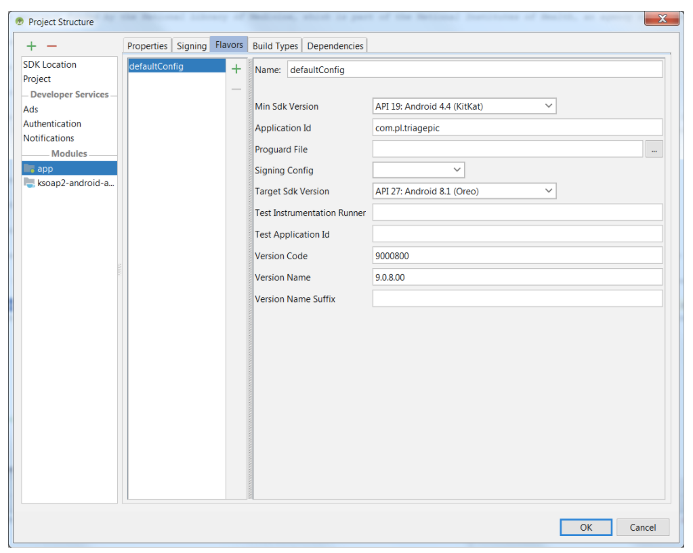

# TriagePic - Android #

This is the Android version of the TriagePic client software used by hospital staff to reunify friends and family during a mass disaster. TriagePic is a reporting and tracking tool that allows staff to capture photos and brief information (name, age, gender, etc.) on disaster victims as they arrive at the hospital. This information on victims is stored in a database that may be searched by staff for family reunification purposes.  

The TriagePic app and TriageTrak web app are products of the Lost Person Finder project (now defunct) at the Lister Hill National Center for Biomedical Communications, which is an intramural R&D division of the U.S. National Library of Medicine, part of the U.S. National Institutes of Health.  

### Installation ###

- App runs on Android 5 (Lollipop) and above    
- Tested/developed with Android Studio 3.1.4  
- Built With Java language, Android API, MySQL, KSOAP  
- To run this app you will need to define your own URL endpoint and a web site provide web services  
- The Top-Level Build File:  

```
apply plugin: 'com.android.application'

android {
    compileSdkVersion 27
    buildToolsVersion '27.0.3'
    defaultConfig {
        applicationId "com.pl.triagepic"
        minSdkVersion 19
        targetSdkVersion 27
        versionCode 9000800
        versionName '9.0.8.00'

        multiDexEnabled true //important

        // following is important.
        // without them, failed to compile and return error "out of memory"
        dexOptions {
            incremental true
            javaMaxHeapSize "2048M"
        }
    }
    buildTypes {
        release {
            minifyEnabled false
            proguardFiles getDefaultProguardFile('proguard-android.txt'), 'proguard-rules.pro'
        }
    }

    compileOptions {
        sourceCompatibility JavaVersion.VERSION_1_8
        targetCompatibility JavaVersion.VERSION_1_8
    }
    productFlavors {
    }
    dexOptions {
        incremental true
    }
}

dependencies {
    compile fileTree(include: ['*.jar'], dir: 'libs')
    implementation files('libs/jira-rest-java-client-core-2.0.0-m19.jar')
    implementation files('libs/ksoap2-android-assembly-2.6.4-jar-with-dependencies.jar')
}
```

### Project Settings ###

  

  

